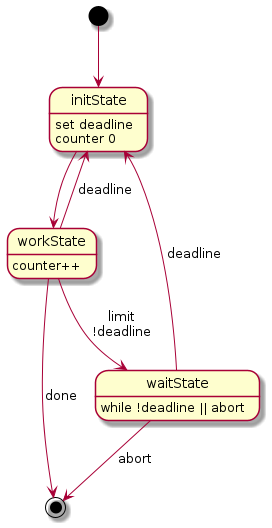
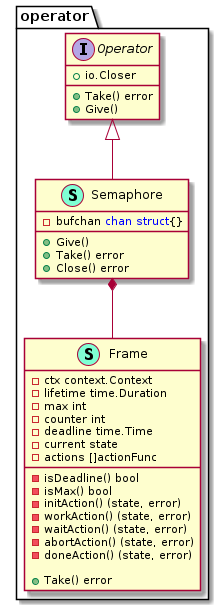

# Rate limiter

## Задача

Написать ratelimit'ер со следующими критериями:

1. на вход принимает набор команд
2. запускает не более N команд одновременно, но не более X команд в минуту
3. имеет два параметра запуска -n и -x.

## Запуск приложения

```bash
~/.../ratelimiter$ make n=10 x=20
```

or

```bash
~/.../ratelimiter/cmd/ratelimiter$ ratelimiter -n=10 -x=20
```

## Документация

```bash
    godoc -http=:6060  -goroot=$GOPATH
```

## Решение

В реализации использован метод кадрирования: первая команда порождает создание фрейма фиксированного размера (1 минута). За это расчетное время должно быть выполнено не более X команд и не более, чем N одновременно.

Для того чтобы запускать команды из непрерывного потока одновременно, можно использовать ограниченный набор горутин, например, путем создания семафора на буферизованном канале: [semaphore.go](./pkg/operator/semaphore.go).
Размер канала соответствует максимальному числу одновременно работающих команд.
При запуске горутины с командой в буферизованный канал помещается пустая структура, при завершении работы горутины, структура читается из канала. Таким образом, максимальное число запушенных одновременно горутин будет соответствовать размеру канала.

Фрейм работает аналогичным образом, только добавлена логика работы с фрейма на основе ДКА [frame.go](./pkg/operator/frame.go).

## Фрейм



